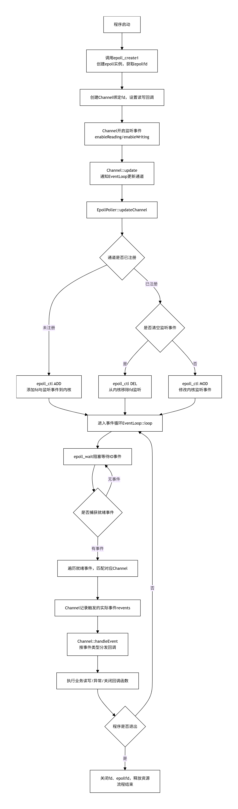

## 基于Reactor模式的C++高性能网络服务框架Tupo

### 目录结构

```txt
Tupo/
├── include/
|   |
|   ├── tupo
|   |     ├── base/
|   |     |     ├── MutexLock.h 
|   |     |     ├── Atomic.h
|   |     |     ├── Condition.h
|   |     |     ├── Thread.h
|   |     |
|   |     └── net/
│   ├── 
│   ├── 
│   └──
├── src/
│   ├── base/
│   │   └── MutexLock.cpp
│   └── net/
│       ├── 
│       ├── 
│       └── 
└── tests/
    ├── test_mutex.cpp
    └── 
```


```txt
Phase 1:
base/ → noncopyable.h → Atomic.h → Mutex.h → Condition.h → Timestamp.h
net/ → Channel.h → Poller.h → EventLoop.h

Phase 2:  
base/ → Thread.h → ThreadPool.h → Logging.h
net/ → Timer.h → TimerQueue.h → Acceptor.h → TcpConnection.h

Phase 3:
base/ → AsyncLogging.h → Singleton.h
net/ → Buffer.h → TcpServer.h → EventLoopThreadPool.h
```

### 代码工作流程




### TimerQueue

**reset()算法**


### 问题


**问题一**

问题：定时器不触发，poll一直超时10秒


问题描述：测试TimerQueue时候，通过runAt来添加定时器触发回调，并通过runAfter在5s之后，停止poll，但是发现一直阻塞，一直超时10s，然后每10s超时一次

根本原因：
- timerfd就像一个只能设置一个时间的闹钟
- 我添加了定时器到timers_，但没有调用resetTimerfd()也就是没有通过timerfd_settime设置timerfd定时器
- 所以闹钟根本没上弦，永远不会响

解决方案：
- 添加定时器时，如果是最早的，必须调用resetTimerfd()
- 定时器触发后，如果有下一个定时器，再次调用resetTimerfd()


一句话总结：
timers_是备忘录，timerfd是闹钟，备忘录改了必须同步闹钟


**问题二**

问题：Thread类封装关于构造函数和线程id的获取


问题描述：在进行Thread类进行TDD测试发现，移动构造和移动赋值没有实现，拷贝构造和拷贝赋值声明了，属于五法则。关于线程id获取，第一次是调用currentThreadTid获取的是调用该函数线程的id，第二次是主线程过早获取tid，没有等待子线程完成，导致获取的线程id为0。

根本原因：

五法则问题：
- 类中包含std::atomic成员，其移动构造被删除
- 声明了拷贝构造/赋值的删除，但没有实现移动语义
- 编译器不会自动生成移动操作，导致类型不可移动

线程ID问题：

- start()中启动子线程后立即返回，没有同步机制
- 主线程调用getTid()时，子线程可能还未执行tid_ = currentThreadTid()
- currentThreadTid()是静态方法，返回调用者的TID，而非存储的tid_

解决方案：

- 实现移动构造和移动赋值，删除拷贝构造和拷贝赋值的原因是，线程的资源不能被两个对象同时管理
- 利用promise/future进行一次性的线程同步，底层原理是条件变量+mutex

