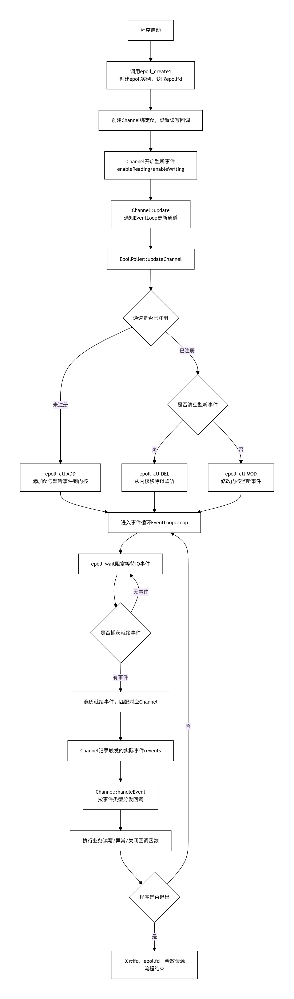

## 基于Reactor模式的C++高性能网络服务框架Tupo

### 目录结构

```txt
Tupo/
├── CMakeLists.txt                  # 顶层构建脚本,生成 tupo_base / tupo_net 两个静态库
├── README.md
├── build.sh                        # 一键编译脚本
├── .clang-format                   # 代码风格配置
├── .resource/
│   └── image.png                   # 代码工作流程图
├── examples/
│   └── ThreadEventLoop.cpp         # 示例:多线程各跑一个 EventLoop
├── include/tupo/                   # 公共头文件(接口)
│   ├── base/                       # 基础库
│   │   ├── MutexLock.h             # 互斥锁封装
│   │   ├── Condition.h             # 条件变量
│   │   ├── Thread.h                # 线程封装(移动语义 + promise/future 同步)
│   │   └── Timestamp.h             # 时间戳
│   └── net/                        # 网络库
│       ├── EventLoop.h             # 事件循环核心(one loop per thread)
│       ├── Channel.h               # fd 事件分发
│       ├── Poller.h                # IO 多路复用抽象接口
│       ├── Timer.h                 # 定时器
│       ├── TimerId.h               # 定时器标识
│       ├── TimerQueue.h            # 定时器队列(timerfd 驱动)
│       ├── Socket.h                # socket 封装
│       ├── InetAddress.h           # 网络地址封装
│       ├── Acceptor.h              # 监听与 accept
│       ├── TcpConnection.h         # TCP 连接
│       ├── TcpServer.h             # TCP 服务端
│       └── poller/
│           ├── EpollPoller.h       # epoll 实现
│           └── PollPoller.h        # poll 实现
├── src/                            # 实现(与 include 一一对应)
│   ├── base/
│   │   ├── MutexLock.cpp
│   │   ├── Condition.cpp
│   │   ├── Thread.cpp
│   │   └── Timestamp.cpp
│   └── net/
│       ├── EventLoop.cpp
│       ├── Channel.cpp
│       ├── Poller.cpp
│       ├── Timer.cpp
│       ├── TimerQueue.cpp
│       ├── Socket.cpp
│       ├── InetAddress.cpp
│       ├── Acceptor.cpp
│       ├── TcpConnection.cpp
│       ├── TcpServer.cpp
│       └── poller/
│           ├── EpollPoller.cpp
│           └── PollPoller.cpp
└── tests/                          # TDD 单元测试
    ├── CMakeLists.txt              # 测试构建脚本
    ├── build.sh
    ├── base/
    │   ├── MutexLock_test.cpp
    │   ├── Thread_test.cpp
    │   └── Timestamp_test.cpp
    └── net/
        ├── EpollPoller_test.cpp
        ├── PollPoller_test.cpp
        ├── EventLoop_test.cpp
        ├── EventLoop_UnitTest.cpp
        ├── Timer_test.cpp
        ├── TimerId_test.cpp
        ├── TimerQueue_test.cpp
        ├── TimerQueueMultiThreadTest.cpp
        ├── Socket_test.cpp
        ├── InetAddress_test.cpp
        └── TcpServer_test.cpp
```

### 开发路线图

```txt
Phase 1:
base/ → MutexLock.h → Condition.h → Timestamp.h 
net/ → Channel.h → Poller.h → EpollPoller.h → PollPoller.h → EventLoop.h

Phase 2:  
base/ → Thread.h → ThreadPool.h → Logging.h 
net/ → Timer.h → TimerQueue.h → Acceptor.h → TcpConnection.h

Phase 3:
base/ → AsyncLogging.h → Singleton.h
net/ → Buffer.h → TcpServer.h → EventLoopThreadPool.h
```

### 代码工作流程



### 将Channel 的文件描述符注册、修改或删除到 epoll 实例中

```text
用户代码
    |
    v
channel->enableReading()
    |
    v    
Channel::update()
    |
    v
loop_->updateChannel(this)
    |
    v
EPollPoller::updateChannel(channel)
    |
    v
poller_->updateChannel(channel)
    |
    v
EPollPoller::update(operation, channel)
    |
    v
epoll_ctl(epollfd_, operation, fd, &event)  ← 系统调用
```

### TimerQueue

**reset()算法**

### InetAddress

**业务场景**

场景1：服务端监听所有网卡

```cpp
// 我想在 8080 端口提供服务，接受任何网卡的连接
InetAddress addr(8080);  
// 内部：0.0.0.0:8080（所有网卡）
```

场景2：服务端只监听本地（测试/调试用）

```cpp
// 我只想让本机连接，不让外部访问
InetAddress addr(8080, true);  
// 内部：127.0.0.1:8080（只能本机访问）
```

场景3：客户端连接指定服务器

```cpp
// 我要连接 192.168.1.100 的 8080 端口
InetAddress serverAddr("192.168.1.100", 8080);
```

场景4：从 accept 获取客户端地址

```cpp
// accept 系统调用返回的是 C 结构体
struct sockaddr_in clientAddr;
socklen_t len = sizeof(clientAddr);
int connfd = accept(listenFd, (struct sockaddr*)&clientAddr, &len);

// 需要把它转成 InetAddress 才能方便使用
InetAddress peer(clientAddr);  // 封装成 InetAddress
std::cout << "新连接来自: " << peer.toIpPort() << std::endl;
// 输出：新连接来自: 192.168.1.50:54321
```

### 问题


**问题一**

问题：定时器不触发，poll一直超时10秒


问题描述：测试TimerQueue时候，通过runAt来添加定时器触发回调，并通过runAfter在5s之后，停止poll，但是发现一直阻塞，一直超时10s，然后每10s超时一次

根本原因：
- timerfd就像一个只能设置一个时间的闹钟
- 我添加了定时器到timers_，但没有调用resetTimerfd()也就是没有通过timerfd_settime设置timerfd定时器
- 所以闹钟根本没上弦，永远不会响

解决方案：
- 添加定时器时，如果是最早的，必须调用resetTimerfd()
- 定时器触发后，如果有下一个定时器，再次调用resetTimerfd()


一句话总结：
timers_是备忘录，timerfd是闹钟，备忘录改了必须同步闹钟


**问题二**

问题：Thread类封装关于构造函数和线程id的获取


问题描述：在进行Thread类进行TDD测试发现，移动构造和移动赋值没有实现，拷贝构造和拷贝赋值声明了，属于五法则。关于线程id获取，第一次是调用currentThreadTid获取的是调用该函数线程的id，第二次是主线程过早获取tid，没有等待子线程完成，导致获取的线程id为0。

根本原因：

五法则问题：
- 类中包含std::atomic成员，其移动构造被删除
- 声明了拷贝构造/赋值的删除，但没有实现移动语义
- 编译器不会自动生成移动操作，导致类型不可移动

线程ID问题：

- start()中启动子线程后立即返回，没有同步机制
- 主线程调用getTid()时，子线程可能还未执行tid_ = currentThreadTid()
- currentThreadTid()是静态方法，返回调用者的TID，而非存储的tid_

解决方案：

- 实现移动构造和移动赋值，删除拷贝构造和拷贝赋值的原因是，线程的资源不能被两个对象同时管理
- 利用promise/future进行一次性的线程同步，底层原理是条件变量+mutex


**问题三**

问题：多 Reactor（线程数 > 0）下，连接关闭时 SIGSEGV

问题描述：单 Reactor（`numThreads = 0`）压测一切正常；切成 4 个 subLoop 后，wrk 一跑完（连接批量断开）立刻 coredump。

```text
#0  EventLoop::isInLoopThread (this=0x0)
#1  EventLoop::runInLoop(...) (this=0x0)
#2  TcpServer::removeConnectionInLoop(...) at TcpServer.cpp:56
```

根本原因：

① 直接原因 —— `conn->getLoop()` 返回了 nullptr

```cpp
EventLoop *TcpConnection::getLoop() {
  loop_->assertInLoopThread();
  if (loop_->isInLoopThread()) return loop_;
  else return nullptr;          // ← 多 Reactor 下 100% 走这里
}
```

`removeConnectionInLoop` 跑在 baseLoop 线程，而 `conn` 属于 subLoop，`isInLoopThread()` 恒为 false → 返回 nullptr → `nullptr->runInLoop(...)` → 成员函数收到 `this = 0` → 读 `threadId_` 即访问地址 `0x10` → 落入系统为 NULL 保留的未映射区（`0x0 ~ 0x8000000`）→ SIGSEGV。

② 深层原因 —— 混淆了「对象归属」与「执行位置」

| 问题 | 性质 | 答案是否随调用线程变化 |
|---|---|---|
| `getLoop()`：这条连接归哪个 loop | 属性查询 | 否，恒定 |
| `isInLoopThread()`：我现在在不在那个 loop 的线程 | 运行时判断 | 是 |

③ 为什么这个查询必然发生在"别的线程"—— 连接销毁是两段式

```text
子线程(subLoop)  handleClose → TcpServer::removeConnection
   │ ① mainLoop_->runInLoop(...)              子 → 主
   ▼
主线程(baseLoop) removeConnectionInLoop
   │   connections_.erase(fd)                 连接表由 baseLoop 独占，必须在这改
   │   conn->getLoop()                        ← 在主线程查询归属（正常）
   │ ② conn->getLoop()->runInLoop(...)        主 → 子
   ▼
子线程(subLoop)  connectDestroyed
       channel_->remove() + ::close(fd)       Channel 归 subLoop，必须在这拆
```

- 全放子线程：`erase` 与 baseLoop 的 `insert` 并发写 `unordered_map` → 崩溃
- 全放主线程：`channel_->remove()` 操作 subLoop 的 Poller → 崩溃

所以必须来回一次：**连接表归主线程改，Channel 归子线程拆**。

解决方案：

```cpp
EventLoop *TcpConnection::getLoop() { return loop_; }   // 纯 getter，去掉线程判断
```

改完后 `runInLoop` 内部那个 `isInLoopThread()` 依然返回 false ——**这是好事**，正是它触发跨线程投递（`queueInLoop` + `wakeup`）。**同一个 false，在 `getLoop()` 里被误当成"拒绝回答的理由"，在 `runInLoop` 里才是"需要跨线程投递"的正确信号。**

一句话总结：
getLoop 回答的是"归谁"，isInLoopThread 回答的是"我在哪"；用后者决定前者，等于要求调度员必须站在骑手位置上才能查派单表——永远查不到，还拿到一张空纸条。


**问题四**

问题：连接关闭后 Channel 未从 Poller 移除，fd 号被重新分配时撞车

问题描述：第二次压测必崩 —— `Assertion 'channels_[channel->fd()] == channel' failed`

根本原因：

两层删除只做了一层：

| 操作 | 从 epoll 实例删除 | 从 `channels_` 删除 |
|---|---|---|
| `disableAll()` | ✅（`EPOLL_CTL_DEL`） | ❌ **保留** |
| `remove()` | ✅ | ✅ |

连接关闭只调了 `disableAll()`，`channels_` 里的记录永远没被 erase；更糟的是 `disableAll()` 会把 `addedToLoop_` 置 false，导致后面 `remove()` 的 `if (loop_ && addedToLoop_)` 判断为假 —— **remove 完全空转**。

于是旧记录滞留；fd 号被 close 后归还内核，新连接 accept 时**分配到一个全新的 socket，但槽位号相同**；用户态 `channels_` 是按号码索引的 → 查到旧 Channel → 与新 Channel 不是同一个对象 → assert 失败。

注意一个精确区分：**内核并没有"复用 fd"，是两个不同的文件描述符共用了同一个号码**。fd 号是可再分配的槽位编号，不是对象的身份标识——用不稳定标识去索引稳定对象，撞车只是时间问题。

解决方案：

1. `disableAll()` 不再清 `addedToLoop_`（该标志语义是"是否还在 Poller 容器里"，而 disableAll 时它明明还在，语义不一致正是根源）
2. `TcpConnection::connectDestroyed()` 中补 `channel_->remove()`
3. 根治：启用 `Channel::index_` 做三态（`kNew` / `kAdded` / `kDeleted`），muduo 用 `kDeleted` 表示"已从 epoll 删除、仍在 map 中"

一句话总结：
内核里摘掉的是"监听关系"，map 里没删的是"登记记录"；号码被新连接重新分配时，旧记录就成了指向已析构对象的野指针——好在那条 assert 把"随机内存破坏"变成了"确定性崩溃"。


**问题五**

问题：日志刷屏 `EPollPoller::update() error: 2`

问题描述：每次连接关闭都打印一行 ERROR（500 并发就是 500 行）。

根本原因：errno = 2（**ENOENT**），`epoll_ctl` 试图删除一个**已经不在 epoll 实例中**的 fd。

`handleClose()` 与 `connectDestroyed()` 各调了一次 `disableAll()`，第二次发 `EPOLL_CTL_DEL` 时，fd 已被第一次删掉了。

**与问题四同源**：`updateChannel()` 用 `isManaged`（在不在 map 里）当作"在不在 epoll 里"来用，而这两者在 disableAll 之后就分叉了——**"在 map 里、但不在 epoll 里"这个中间态，代码没有表达**。

解决方案：`connectDestroyed()` 里去掉多余的 `disableAll()`，只保留 `remove()`（`removeChannel()` 内部有 `if (!isNoneEvent())` 保护，不会重复 DEL）。`handleClose()` 那次要保留——它负责在跨线程延迟期间立刻停止监听。

一句话总结：
不致命，但刷屏、多一次系统调用，且会掩盖真正的错误；根治同样是 `index_` 三态。

